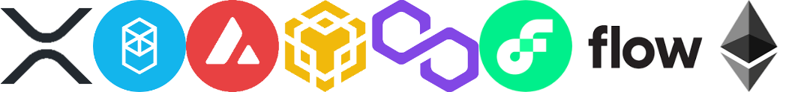

<!--
**DanishIsmail/DanishIsmail** is a ✨ _special_ ✨ repository because its `README.md` (this file) appears on your GitHub profile.

Here are some ideas to get you started:

- 🔭 I’m currently working on ...
- 🌱 I’m currently learning ...
- 👯 I’m looking to collaborate on ...
- 🤔 I’m looking for help with ...
- 💬 Ask me about ...
- 📫 How to reach me: ...
- 😄 Pronouns: ...
- ⚡ Fun fact: ...
-->
<h2> Hi there 👋, I'm Danish Ismail </h2>
    

I'm a Full-stack Blockchain Developer with an experience in multiple Blockchains like (Ethereum and Flow). I am also a contributor in flow Blockchain with my other GitHub account [danishgakher](https://github.com/danishtroon) you can check by navigating to [onflow/cadence](https://github.com/onflow/cadence/graphs/contributors).
I am a problem solver who always thinks about how to solve real-life problems using high-end technology.I am committed to making society free from problems by making every possible business with inherent features – Transparency, Incentivization & Decision-making rights.

### TECHNICAL SKILLS

Languages - Solidity, Cadence, Php, Pyhton, Javascript, Typescript, C++, C#, Html , Css. Also working on GoLong and Rust.
Front-End Development - HTML5, CSS3, Bootstrap, Jquery.
Frameworks - ASP.NET Core, React Js, Angular JS, Node Js, Express.js, Wordpress, Laravel.
Blockchain - Ethereum, Flow
Databases - SQL Server, MongoDB, MySQL.
Version Control - Git,

This was last updated on `07-Feb-2023`.

### Blockchain

  
 
### Platforms and Framworks
  
 
### Programing Languages
 

Feel free to reach out on the [Telegram](https://t.me/@DanishGakher) directly. And if not available, email me I'll contact you asap.!
